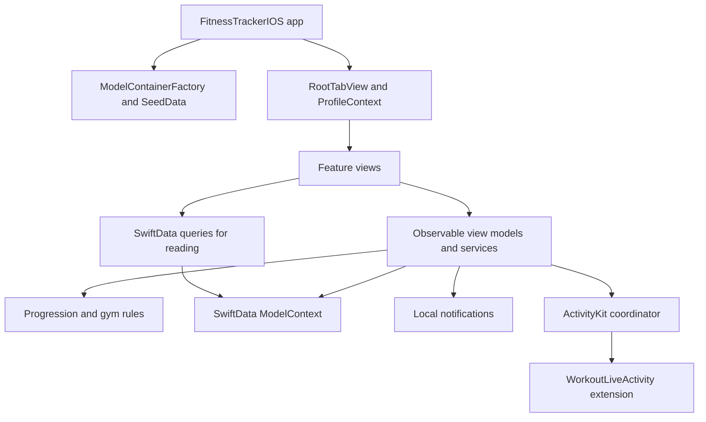
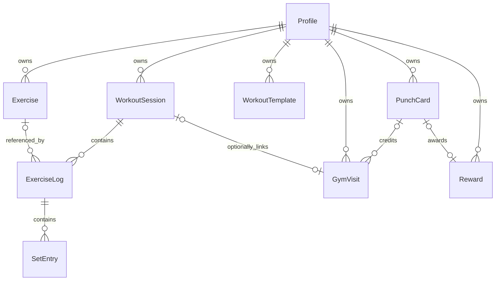

# Architecture and code walkthrough

This guide describes the implementation as of September 30, 2026. Start here for the structure, then read the [feature reference](FEATURES.md) for individual behaviors and the [maintenance guide](MAINTENANCE.md) for changes and testing. The [README](../README.md) covers installation.

## 1. The big picture

FitnessTracker is a local app with two profiles, not a client/server system. SwiftData holds the records on the device. SwiftUI renders them. There is no login, network API, third-party package, or synchronization between phones.



The code follows pragmatic MVVM: **views** handle presentation, **view models** own interactive state and actions, and **models** are persisted records. Read-only screens use `@Query` directly. Some small screens, such as templates and settings, also coordinate saves themselves; there is no repository abstraction or mandatory view model for every view.

## 2. Targets and folders

| Location | Responsibility |
| --- | --- |
| [Package.swift](../Package.swift) | Two library products, one test target; iOS 17/macOS 14 minimums |
| [iOS app entry point](../iOSApp/FitnessTrackerIOS/FitnessTrackerIOSApp.swift) | Opens the store, installs seeds, supplies environment dependencies |
| [App](../Sources/FitnessTracker/App) | Tabs, selected profile, preview host |
| [Models](../Sources/FitnessTracker/Models) | Nine SwiftData entity types and input rules |
| [Persistence](../Sources/FitnessTracker/Persistence) | Container creation, libraries, baseline imports, one-time corrections, preview data |
| [Features](../Sources/FitnessTracker/Features) | Screens, view models, services, and calculations grouped by capability |
| [Shared](../Sources/FitnessTracker/Shared) | Reusable accessible controls |
| [WorkoutActivitySupport](../Sources/WorkoutActivitySupport/WorkoutActivityAttributes.swift) | Small ActivityKit data contract shared by app and extension |
| [Widget extension](../iOSApp/WorkoutLiveActivity/WorkoutLiveActivity.swift) | Lock Screen and Dynamic Island presentation |
| [Tests](../Tests/FitnessTrackerTests) | Pure-rule and SwiftData integration tests |
| [scripts](../scripts) | Lightweight rule checks without the full UI framework stack |

The app links `FitnessTracker`; that library depends on `WorkoutActivitySupport`. The widget links only the support product. It receives activity state rather than opening the workout database. The Xcode app target embeds the widget extension.

`iOSApp/FitnessTrackerApp.swift` is an alternative host example, not a second entry point to add to the app target. The generated `ContentView.swift` is a leftover example; the running app opens `RootTabView`.

## 3. Startup and navigation

1. `FitnessTrackerApp.loadStore()` calls `ModelContainerFactory.make()`.
2. The factory registers all nine entities and explicitly disables CloudKit. Production uses disk storage; tests/previews can request memory-only storage.
3. `SeedData.install()` installs missing seed versions and saves.
4. The app injects its container and `ProfileContext` into `RootTabView`.
5. `ProfileContext.restore()` selects the remembered UUID if it still exists, otherwise the first profile.
6. Root reconciles orphaned Live Activities against active workout IDs.

A store-opening error renders an error and **Try again**. It does not delete or silently replace the database.

The root header contains the profile picker and global settings. Below it are five tabs, each with a `NavigationStack`: **Today**, **History**, **Exercises**, **Progress**, and **Rewards**. The header stays visible on pushed screens. Sheets have their own presentation; they do not automatically inherit a visible root header.

The tabs have an identity combining the profile UUID and `restoreGeneration`. Changing either recreates their navigation/transient state. Saved sessions remain in SwiftData. Train Together has its own local turn selection and does not change the global selected profile.

## 4. Persistent model graph



| Model | Meaning and important fields |
| --- | --- |
| `Profile` | UUID, name, avatar, owned collections, reward eligibility/message, seed-version markers |
| `Exercise` | Profile-specific library definition: name, muscle group, equipment, kg/lb, assistance semantics, rep range/increment, favorite, photo, starting reference, load/setup notes |
| `WorkoutSession` | Profile, start/end, active/completed status, notes, rest deadline, date-only import flag |
| `ExerciseLog` | Exercise occurrence in a session: order, notes, snapshots of name/unit/assistance/rep range/increment/load notes/muscle group |
| `SetEntry` | Order, weight, full reps, partial reps, optional RPE, warm-up flag, completion date |
| `WorkoutTemplate` | Profile, name, ordered exercise UUIDs, one set-count value used for every exercise |
| `GymVisit` | Profile/date, unique day key, punch eligibility, credited timestamp, optional card/session |
| `PunchCard` | Required visits, carried-over punches, start/completion/archive dates, credited visits and reward |
| `Reward` | Message snapshot plus earned/redemption dates and owning profile/card |

Relationships are optional in the SwiftData declarations, even where normal constructors require an owner. Constructors validate cross-profile log/visit/reward relationships. Future mutation code must maintain those invariants too: mutable model properties do not automatically enforce every business rule.

### Why logs snapshot exercise data

The library describes what to do now; a log describes what happened then. Changing an exercise from kg to lb must not relabel an old 20 kg set as 20 lb. Historical log units remain intact, while comparison/prefill adapters convert weights where appropriate. Setup notes and photos remain library data, so they are not historical snapshots.

Deleting an exercise nullifies its log links but preserves log snapshots and sets. Those records stay readable in History, although progression no longer has the linked exercise history. Archiving an exercise is preferable when retaining that connection matters. Deleting a session cascades through logs and sets. Deleting a profile cascades through its owned records. Template UUID arrays are not SwiftData relationships; starting a template resolves available exercises and skips missing/archived ones.

### Planned versus completed

`SetEntry.completedAt == nil` means planned. A completed date means performed. Repeating a workout or starting a template inserts planned sets; these are not progress until logged. Undo clears the completion date rather than deleting the set.

## 5. State ownership and saves

| State | Owner | Survives relaunch? |
| --- | --- | --- |
| Workouts, sets, exercise configuration, pictures, visits, rewards | SwiftData | Yes |
| Selected profile UUID | `ProfileContext` plus UserDefaults | Yes |
| Notification/Live Activity preferences; restore-generation counter | UserDefaults / `@AppStorage` | Yes; not included in the backup data graph |
| Typed set drafts, most recent undo ID, current PR banner | `WorkoutViewModel` | No |
| Together turn and selected exercise per person | `TogetherWorkoutViewModel` | No; underlying workouts survive |
| Presented sheet, search text, navigation state | SwiftUI state | Generally no |

Interactive model/service mutations run on the main actor. The workout view model explicitly saves after actions and rolls back on save failure. Gym check-in and claim each make one synchronous save with rollback. UI effects follow successful persistence. Train Together finishes each profile separately; it is not one all-or-nothing transaction across both sessions.

Most flows share the injected main `ModelContext`. A rollback affects pending changes in that context, which is one reason editors use draft values before saving. Do not add unrelated pending writes and assume rollback is isolated to one entity.

## 6. Trace a set from tap to chart

```mermaid
sequenceDiagram
    participant Card as ExerciseSetCard
    participant VM as WorkoutViewModel
    participant DB as ModelContext
    participant OS as Notifications and ActivityKit
    Card->>VM: updateDraft(weight, reps, partialReps)
    Card->>VM: logSet(log)
    VM->>VM: Validate and complete planned set or create entry
    VM->>VM: Set restEndsAt to now + 180 seconds
    VM->>DB: save()
    DB-->>VM: Success
    VM->>VM: Clear draft; remember undo ID; calculate PR
    VM->>OS: Schedule alert and update activity
    VM-->>Card: Observable state updates
```

The card asks `ExerciseProgress` for a comparison. That adapter extracts completed working sets, converts units, and calls `ProgressionEngine`, which knows nothing about SwiftUI or SwiftData. Charts use the same adapted history. Editing a historical set therefore changes calculated charts/targets without repairing a separate aggregate table.

## 7. Boundaries to understand before changing logic

- **Profiles are data partitions, not authenticated accounts.** Shared screens intentionally read both profiles; ordinary history and library screens filter by profile UUID.
- **Workout and gym check-in are independent.** Logging/finishing a workout does not create a visit or punch. A joint visit creates one visit per person, not a shared workout.
- **Recorded load is the calculation basis.** There is no structured per-side/per-hand multiplier or bar-weight model. Load notes explain the convention; formulas do not infer total resistance from them.
- **Progression and personal records differ.** Progress compares sessions; PRs compare an individual set to earlier sets, including earlier sets today.
- **Summary and progression filters differ.** The workout summary includes all completed sets, including warm-ups. Progression/charts/PRs exclude warm-ups. Both omit partial reps from weight × reps calculations.
- **Schema evolution and personal imports differ.** Per-profile seed markers prevent repeated data imports/corrections. They are not a `VersionedSchema`/`SchemaMigrationPlan`; neither is currently defined. A future incompatible schema change needs its own migration design.

For exact formulas, lifecycle rules, and feature entry points, continue to the [feature reference](FEATURES.md).
