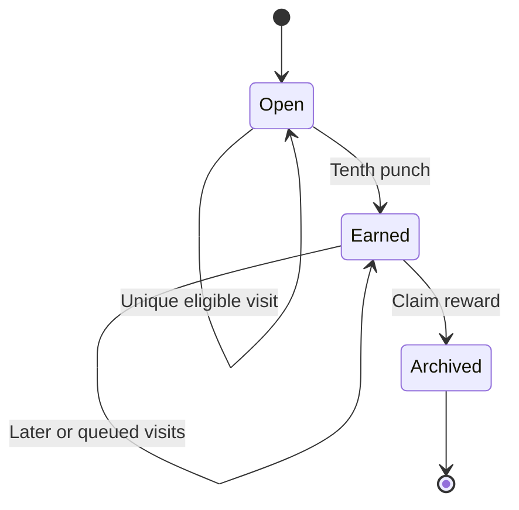

# Feature reference and business rules

This is a code-oriented companion to the [architecture guide](ARCHITECTURE.md). Source links point to the implementation, not pseudocode.

## Profiles and avatars

**Where:** Root profile picker → Hai/Qi; Edit profile photos.

[ProfileContext](../Sources/FitnessTracker/App/ProfileContext.swift) stores selection by UUID, not name. Queries and ownership checks keep exercise libraries, sessions, templates, and history separate. Rewards and weekly consistency deliberately show shared information. Switching profiles rebuilds tab navigation but keeps persisted active workouts.

[ProfileAvatarViewModel](../Sources/FitnessTracker/Features/Profiles/ProfileAvatarViewModel.swift) keeps a draft until Save photo. Cancel leaves the saved avatar unchanged. Native PhotosPicker supplies selected image data, and the shared [ExercisePhoto](../Sources/FitnessTracker/Features/Exercises/ExercisePhoto.swift) helper validates a maximum 50 MB input, applies orientation, resizes to at most 1,200 pixels, and writes JPEG at 0.82 quality without copying original EXIF/location metadata. SwiftData external storage holds the bytes; there is no upload. Missing photos use profile symbols.

## Exercise library, photos, favorites, and settings

**Where:** Exercises → + or an exercise → Edit; Create exercise in the workout exercise picker.

[ExerciseEditorViewModel](../Sources/FitnessTracker/Features/Exercises/ExerciseEditorViewModel.swift) trims names, requires 1–100 characters, and rejects case-insensitive duplicates within a profile, including archived exercises. Empty muscle/equipment fields become Other/Unspecified. Editing units converts the exercise's weight increment, not old log weights. Assistance, load notes, setup notes, favorite state, and photos are editable. Photo handling is the same as avatars; the image appears in details and the workout card.

Favorites sort before other exercises; search and Favorites only narrow lists. Setup notes describe seat/cable positions. Load notes explain what number to enter; they do not alter arithmetic.

[ExerciseSettingsViewModel](../Sources/FitnessTracker/Features/Progress/ExerciseSettingsViewModel.swift) edits the progression range and increment: minimum ≥ 1, maximum ≥ minimum and ≤ 100, finite increment 0.05–100. New exercises default to 8–12 reps and 2.5 weight units. New logs copy these settings; existing logs retain their snapshots.

## Start/resume, add exercises, and fast set entry

**Where:** Today → Start Workout → Add Exercises.

[WorkoutViewModel](../Sources/FitnessTracker/Features/Workout/WorkoutViewModel.swift) restores the most recent active session for the profile before creating one. Adding an exercise validates ownership/archive state and refuses duplicate exercise IDs in that session. Logs and sets have explicit integer order fields.

The next draft uses this priority:

1. An unsaved draft already edited on this screen.
2. The first planned set in the log.
3. The corresponding completed working set from the latest earlier completed occurrence.
4. The latest completed working set today if prior set positions are exhausted.
5. The exercise's starting reference, converted to the log unit.
6. Zero weight and the log's lower rep target.

Previous-session prefills copy full reps, not partial reps. Last-time labels retain original units; prefills convert kg/lb and round to two decimals. The prior-set lookup selects one previous log; the chart adapter separately merges legacy repeated logs per session.

[ExerciseSetCard](../Sources/FitnessTracker/Features/Workout/ExerciseSetCard.swift) offers large steppers/direct numeric entry, last-time values, progression target, Use target, photo/setup/load notes, logged sets, partial reps, and substitution. Validation accepts finite weight 0–10,000, completed full reps 1–999, and partial reps 0–999. Planned sets may have zero full reps. Optional RPE 1–10 and warm-up status exist in the model, but the current quick-entry/editor UI does not expose them.

## Partial reps, editing, and undo

**Where:** Partial reps stepper; tap a completed set in Today or History; Undo last set in Today/Together.

`reps` and `partialReps` are separate integers: 9 full + 1 partial is stored as `9` and `1`, never `9.5`. Partials are visible in History/last-time values and exported separately. They do not increase progression, volume, estimated 1RM, or PRs. At least one full rep is still required to log a completed set.

[SetEditingService](../Sources/FitnessTracker/Features/Workout/SetEditingService.swift) validates edits, saves or rolls back, and cancels rest-related state for active sessions. Delete requires UI confirmation. Historical edits recalculate derived history rather than modifying stored totals. Undo returns only the most recently logged set known to that view model to planned state and clears rest/PR state. The undo ID is transient: it is not a durable multi-step undo stack.

## Rest timer, notifications, and Live Activity

**Where:** Workout timer; global gear → Notify when rest ends / Show Live Activity.

Logging sets saves `restEndsAt = now + 180 seconds`. [WorkoutCalculations](../Sources/FitnessTracker/Features/Workout/WorkoutCalculations.swift) computes remaining time from that absolute date, clamped at zero. There is no per-second database write. +30s extends from the later of now/deadline; Skip clears it. Deadlines survive backgrounding and relaunch.

[RestAlerts](../Sources/FitnessTracker/Features/Settings/RestAlerts.swift) requests notification permission on opt-in. Notification identifiers use session UUIDs, keeping profiles independent. Rescheduling cancels the previous request; revision tokens guard asynchronous permission checks against stale requests. Finish/discard/undo/skip cancel the relevant pending alert. iOS Focus and notification settings still control delivery.

[RestLiveActivity](../Sources/FitnessTracker/Features/Activity/RestLiveActivity.swift) serializes ActivityKit update/end operations. Each activity is identified by session UUID. The [shared attributes](../Sources/WorkoutActivitySupport/WorkoutActivityAttributes.swift) contain profile/session identity and content state for exercise, next set, and rest timestamps. The [widget](../iOSApp/WorkoutLiveActivity/WorkoutLiveActivity.swift) draws the countdown locally and shows Ready when appropriate. It does not query SwiftData. Finish/discard ends the activity; root startup removes orphaned activities; restore ends all existing activities. Display/lifetime are ultimately controlled by iOS. Notification and Live Activity preferences are independent.

## Finish, summary, and History

**Where:** Today → Finish Workout; History → a workout.

Finishing requires a completed set, saves a nonnegative duration/end date, marks the session completed, clears rest, and displays [WorkoutSummaryView](../Sources/FitnessTracker/Features/Workout/WorkoutSummaryView.swift). Empty workouts can be discarded; the discard action does not delete workouts containing completed sets.

[WorkoutSummary](../Sources/FitnessTracker/Features/Workout/WorkoutSummary.swift) counts completed sets and logs containing completed sets. It sums `weight × full reps` for non-assisted logs and keeps kg/lb totals separate. This summary includes completed warm-up sets; progression metrics exclude them. Assisted sets still count as sets but contribute no volume. Recorded per-side/per-hand loads are not doubled.

[HistoryView](../Sources/FitnessTracker/Features/History/HistoryView.swift) shows completed workouts, snapshot names/units, notes, and editable sets. Imported baselines are date-only: the screen avoids presenting their artificial storage timestamps as measured time/duration.

## Repeat workout, templates, ordering, and substitution

**Where:** Today → Repeat last workout / Workout templates; active workout → Save as template / Reorder exercises / Swap exercise.

Repeat resolves exercises from the latest eligible completed workout, preserves order, skips missing/archived entries, and uses the number of completed working sets per exercise, bounded to 1–20. New planned sets use progression targets, then a starting reference or zero-load fallback. An unfinished session is resumed, never overwritten by a repeated routine.

[TemplateListView](../Sources/FitnessTracker/Features/Templates/TemplateListView.swift) creates/edits/deletes profile-owned routines. A template stores ordered exercise IDs and a single `setsPerExercise` count (1–20), not distinct counts or weights for each exercise. Starting resolves current library entries and calculates current targets. A routine with no available exercises reports an error. Saving a template does not mark planned work completed.

[ExerciseOrderView](../Sources/FitnessTracker/Features/Workout/ExerciseOrderView.swift) supports drag ordering. `WorkoutViewModel.reorder` requires exactly the current unique log IDs and changes only their order fields.

Substitution only accepts an available, same-profile exercise not already in the session. If the old log has completed sets, it remains and loses only its planned sets; the replacement follows it. Otherwise the replacement takes its position and the unperformed log is deleted. It creates 1–20 planned replacement sets based on remaining planned work, using the replacement's own history/reference. Same-muscle suggestions sort first, but no biomechanical equivalence is inferred.

## Train Together

**Where:** Today → Train together.

[TogetherWorkoutViewModel](../Sources/FitnessTracker/Features/Together/TogetherWorkoutViewModel.swift) coordinates a separate `WorkoutViewModel` for each person. Sessions, drafts, units, targets, timers, and undo remain independent. A successful set advances the local turn. Both rest timers remain visible.

Shared exercise matching lowercases names and removes non-letter/non-number characters. It is exact matching after normalization, not fuzzy or muscle-group matching. A matching entry is selected/added from the partner's own library. If absent, choose that person's alternative explicitly; no exercise or weight is copied from the other profile. Closing keeps sessions active. Finish both finishes nonempty sessions and discards empty ones, saving each independently.

## Progressive overload and next targets

**Where:** Workout badges/targets, finish summary, Exercises → exercise details/settings, Progress.

[ExerciseProgress](../Sources/FitnessTracker/Features/Progress/ExerciseProgress.swift) filters to the same profile/exercise and assistance semantics, uses earlier completed sessions, excludes planned/warm-up sets, normalizes units, and groups repeated logs into one session point. [ProgressionEngine](../Sources/FitnessTracker/Features/Progress/ProgressionEngine.swift) implements the rules, including a short tweakable comment block.

For a nonempty session with comparable history, **any** improvement wins:

| Measure | Improvement |
| --- | --- |
| Peak load | Higher maximum working-set weight |
| Shared load | A set beats the previous best full reps at that same weight |
| Total volume | Higher sum of working-set weight × full reps |

If there is no improvement, a reverse comparison determines regression; otherwise the result is matched. Thus 60 × 8 → 62.5 × 7 is progressed even though volume falls. Weight matching uses 0.01 units of tolerance; volume tolerance is 0.01 × the larger total rep count. An unfinished session shows improvements immediately but defers matched/regressed to avoid judging incomplete work. No history is First session; no working sets is Not logged or In progress.

Double progression evaluates all working sets. To increase load, every set must reach the ceiling, the set count must satisfy the required prior count, and no planned working sets can remain unfinished. Then each set increases by one increment and returns to the rep floor. Otherwise weights stay fixed and each set's reps increase by one up to the ceiling. Example: three sets at 60 × 12 with an 8–12 range and 2.5 increment produce three targets at 62.5 × 8. Sets at 60 × 12, 11, 10 produce targets at 60 × 12, 12, 11. Active-workout targets use completed prior history, not the partially finished current workout.

Assisted exercises reverse peak-load direction: less assistance is better. They still compare reps at the same assistance but do not compare volume or estimate 1RM. Weight increases become assistance decreases, clamped to zero. If load cannot change at a bound, targets do not reset reps merely because the ceiling was reached.

## Charts, stalls, personal records, and weekly consistency

[ExerciseDetailView](../Sources/FitnessTracker/Features/Progress/ExerciseDetailView.swift) uses Swift Charts and a readable session-data alternative. Estimated 1RM is the best working-set Epley estimate, `weight × (1 + reps / 30)`; a single rep uses actual weight. Zero-load sets provide no estimated 1RM. Volume sums weight × full reps. Assisted exercise displays use assistance/reps instead.

[ProgressDashboardView](../Sources/FitnessTracker/Features/Progress/ProgressDashboardView.swift) flags three consecutive completed comparisons without progress: **at least four sessions**, not simply three workouts. A progressed comparison resets the trailing stall count. Empty/active workouts do not count.

[PersonalRecords](../Sources/FitnessTracker/Features/Progress/PersonalRecords.swift) compares a newly completed working set to earlier completed sets in completed sessions or its own current session, using matching profile/exercise/assistance semantics and converted units. It can celebrate highest weight, most reps at that weight, and best estimated 1RM; assisted sets use lowest assistance and reps only. First-ever sets establish a baseline. Unlike progression, its peak/e1RM threshold is 0.001; same-load matching uses less than 0.01. The trophy/haptic/announcement is transient, not a persisted PR ledger.

[WeeklyConsistencyView](../Sources/FitnessTracker/Features/Progress/WeeklyConsistencyView.swift) shows both profiles for Monday–Sunday using local calendar dates. It counts completed sessions containing completed working reps, distinct training dates, and sessions per muscle group. Multiple sessions in a day produce one training day. Slash-separated muscle groups count individually and at most once per session. New log snapshots preserve group labels; older logs fall back to the linked exercise or Unspecified. Baselines count, warm-up-only and unfinished sessions do not. Gym visits are a separate metric.

## Gym visits, punches, rewards, and archives

**Where:** Rewards → Check in at gym / Reward settings / Past punch cards / All gym visits.

[GymVisitService](../Sources/FitnessTracker/Features/Gym/GymVisitService.swift) inserts one record per selected profile for today/a past day. [GymVisitRules](../Sources/FitnessTracker/Features/Gym/GymVisitRules.swift) creates a permanent `profileUUID|YYYY-MM-DD` key using Gregorian components in the chosen calendar's time zone. A precheck plus unique key prevents duplicate daily visits. Joint check-ins insert only missing people. Legacy nil keys are calculated from their dates when checking.

Qi's seeded `punchCardEnabled` flag governs eligibility, not her current name. Hai's visits remain visible without awarding punches. A card combines distinct credited visit dates with carried-over punches. The service limits credit to ten slots. Eligible uncredited visits wait when a completed card has not been claimed.

The tenth credit saves completion/earned dates and presents [RewardCelebrationView](../Sources/FitnessTracker/Features/Gym/RewardCelebrationView.swift), with confetti, haptic, reward message, and Claim reward. Claim records redemption, archives the card, creates the next card, and consumes queued eligible dates in one save. Repeating a claim does nothing. With no queue, the next card is empty; with enough queued visits it can already be full.

Reward text trims whitespace and allows 1–200 characters. Changing it updates the profile and open unearned cards, preserving messages already earned/claimed. Card/visit history survives rollover. Opening Rewards prepares cards and recovers unclaimed rewards. Workout completion never punches a card automatically.

## Personal libraries and baseline imports

**Where:** Starting reference in exercise details; September 26, 2026 in each profile's History.

[SeedData](../Sources/FitnessTracker/Persistence/SeedData.swift) installs the common library, reward eligibility, profile names, personal exercise libraries/references, dated baselines, corrections, partial reps, and Qi's initial punches. Markers on each profile make each step one-time. See the [maintenance guide](MAINTENANCE.md) for ordering and extension rules.

Qi's initial baseline has 13 supplied exercise sets. Hai's has 21 exercises/25 supplied sets. Baselines preserve notes and use the first supplied “or” option only. They create real completed history but no visits. Starting references alone are fallback inputs, not chart points. Imported unknown times/durations are not presented as measured workouts.

Smith weights are plates on **one side**, excluding the bar; dumbbells are per hand. Qi's hip thrust is 15 kg per side; Hai's Smith Bulgarian is 20 kg per side. `2p`, `3p`, and `1p10` are 40, 60, and 30 kg per side. The non-Smith chest-supported barbell row retains total-plates recording. Baseline partials are Qi hamstring curl +3, Qi leg extension +1, Hai Smith row +1. Corrections run once and preserve later edits. Qi's seven starting punches use `carriedOverPunches`, without inventing seven visit dates.

## Backup, CSV, and restore

**Where:** Global gear → Save full backup / Export sets as CSV / Restore full backup.

[FitnessBackup](../Sources/FitnessTracker/Features/Backup/FitnessBackup.swift) uses Codable record structures and UUID references rather than serializing the SwiftData object graph. Version 2 includes partial reps/muscle snapshots; version 1 remains readable with optional-field defaults. The archive includes both profiles, pictures, exercises/settings, sessions/logs/sets, templates, visits/cards/rewards, and seed markers. It does not include transient UI state or all UserDefaults preferences.

[BackupService](../Sources/FitnessTracker/Features/Backup/BackupService.swift) rejects files over 100 MB, unsupported versions, more than 100,000 records, duplicate IDs, and invalid relationships/values. Decode reconstructs a separate in-memory store first. Settings shows archive counts/date and requests replacement confirmation; restore validates again, deletes/repopulates the live graph, then saves once with rollback on failure. Missing exercise links can preserve historical snapshots. Successful restore disables rest notifications, ends activities, and increments `restoreGeneration` to rebuild screens. The Live Activity preference itself is not reset.

CSV contains all stored sets, including planned entries with Completed = No, with separate full/partial reps, units, warm-up state, load convention, and notes. Fields are quoted and formula-like prefixes escaped for spreadsheet viewing. CSV cannot restore data. JSON/photo content is not encrypted by the app; saving it in Files/iCloud Drive is manual backup, not app synchronization.

## Accessibility, empty states, and previews

[AccessibleComponents](../Sources/FitnessTracker/Shared/AccessibleComponents.swift), semantic colors, Dynamic Type layouts, readable chart data, explicit VoiceOver labels, and word/symbol progress states support gym use and dark mode. Reduce Motion suppresses stamp/confetti movement; haptics are iOS-only. Empty library/history/week and first-session states provide contextual text rather than fabricated progress. Persistence failures are surfaced to the user.

[PreviewHost](../Sources/FitnessTracker/App/PreviewHost.swift) and feature preview helpers use fresh in-memory containers, including active workout, progress/stall, reward, large-text, and dark-mode examples. They do not write to the production store. The app icon lives in the host asset catalog, with its generation prompt recorded under `iOSApp`.

Automated coverage and the remaining physical-device checks are listed in [Maintenance](MAINTENANCE.md).
